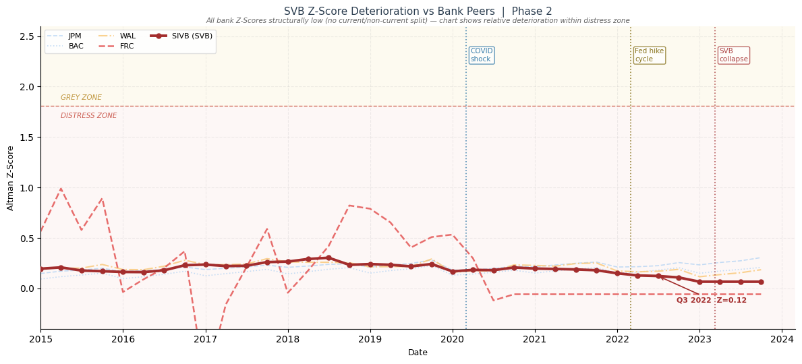
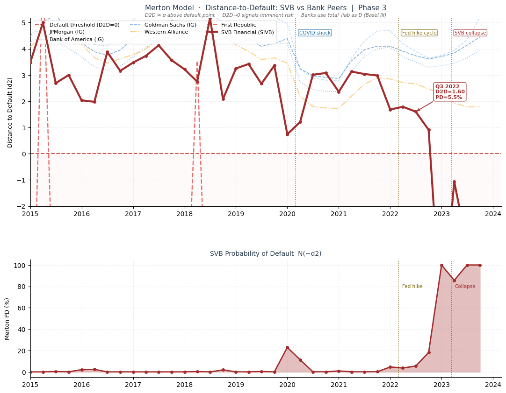
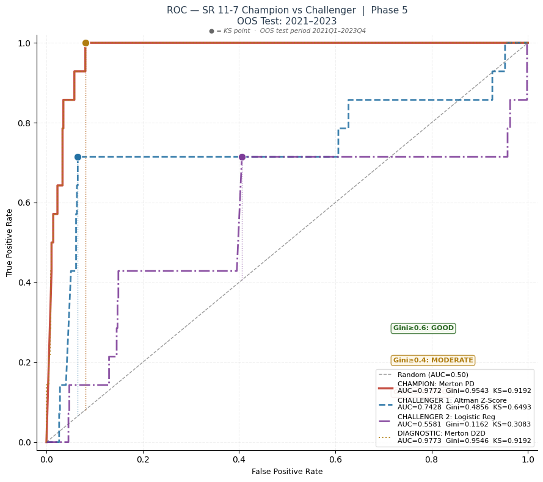
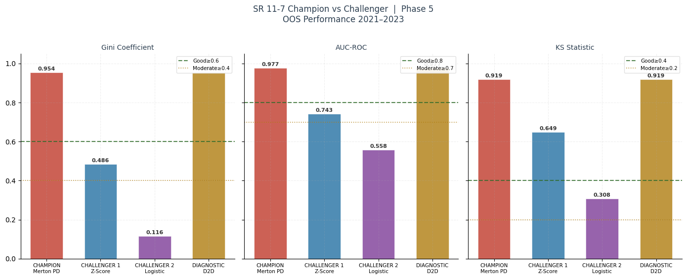
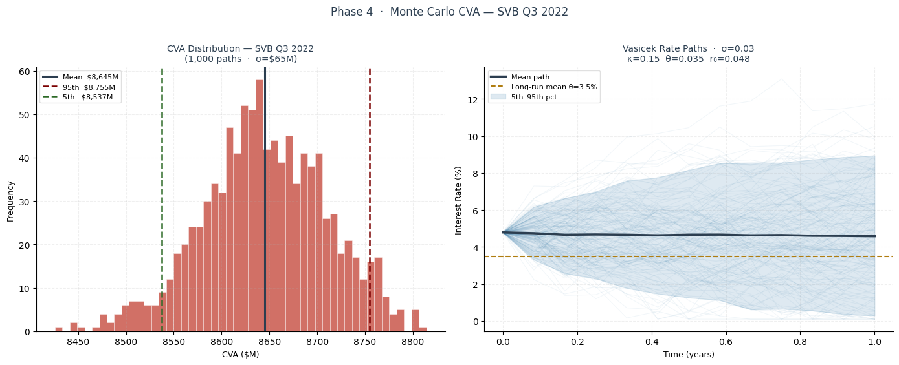
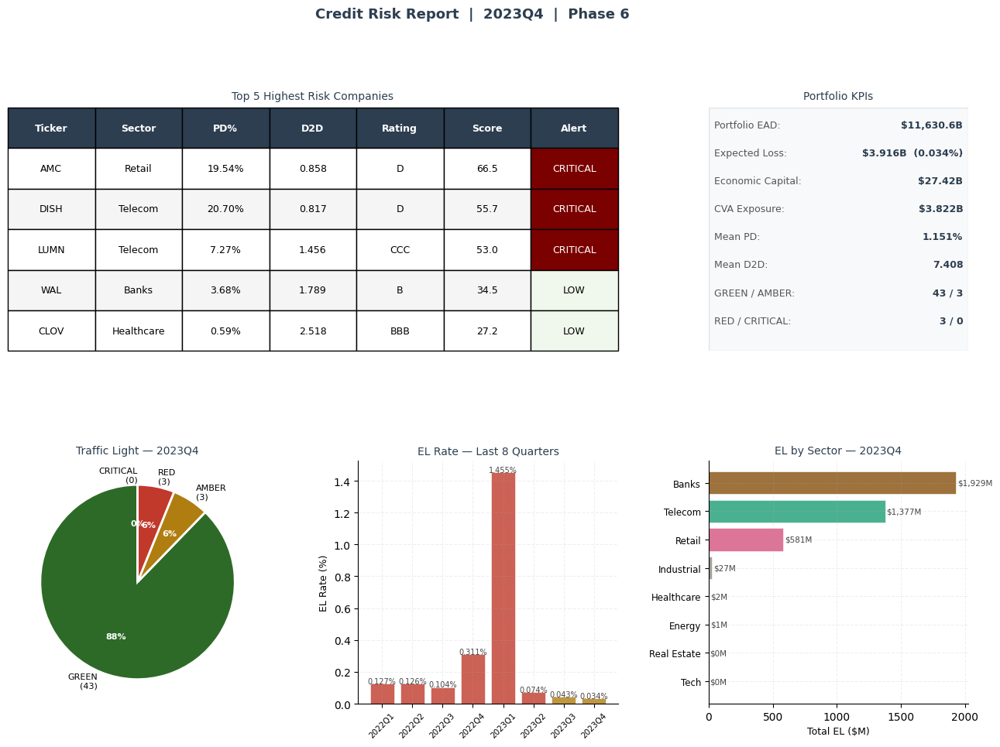

# Credit Risk Modeling & Model Validation

A structural credit risk suite in Python: Altman Z-Score, a Merton distance-to-default model, the full Basel III capital stack (EL, UL, EC, CVA), Kaplan-Meier survival analysis, and an SR 11-7 champion-challenger validation framework. Built on real SEC EDGAR, equity, and FRED data for 60 entities across 2015 to 2023, including the banks that failed in 2023.

*Boopesh Mohanraj · MS Engineering Management, Northeastern University*

---

## What this is

A credit risk team has two jobs: estimate how likely each borrower is to default, and prove to a regulator that the model estimating it actually works. Most student credit projects do the first and skip the second. The second is where real credit risk work lives, and it is governed by the Federal Reserve's SR 11-7 guidance on model risk management.

This project does both, end to end, on a real 60-entity universe (banks, retail, telecom, tech, energy, real estate) using SEC EDGAR financials, market equity data, and FRED rates and spreads. It estimates default probability three ways, builds the Basel III capital stack on top, and then formally validates the models against each other on out-of-sample defaults, including the 2023 banking crisis, using the discrimination and stability metrics a regulator expects.

It runs six phases:

- **Data pipeline** from SEC EDGAR, yfinance, and FRED
- **Altman Z-Score** (the accounting-based challenger)
- **Merton distance-to-default** (the structural champion)
- **Basel III** EL / UL / EC / CVA, with Monte Carlo CVA
- **SR 11-7 validation**: Kaplan-Meier survival plus Gini / AUC / KS / PSI champion-challenger
- **Portfolio application**: scorecard, migration matrix, and a credit risk report

---

## Key results

Every figure and number below is a real output of the code in this repo, computed on live EDGAR, equity, and FRED data. Discrimination metrics are measured out-of-sample on 2021 to 2023.

| Component | What it produced |
|---|---|
| **Merton PD (champion)** | Out-of-sample AUC **0.98**, Gini **0.95**, KS **0.92** on 14 real defaults |
| **Altman Z (challenger)** | Gini 0.49, KS 0.65: useful but clearly weaker than the structural model |
| **Logistic regression** | Gini 0.12 (near-random), an honest negative result on a small default sample |
| **SVB early warning** | Z-Score deteriorating vs peers and Merton PD rising to 5.5% through 2022, ahead of the March 2023 failure |
| **Basel III stack** | EAD $11.6T, Expected Loss $3.9B, Economic Capital $27.4B, CVA $3.8B |
| **Model stability (PSI)** | Merton PSI 0.10 (monitor), Z-Score 0.05 (stable) |

### The hook: the models flagged SVB's deterioration

Silicon Valley Bank sat in the universe, and both models showed it deteriorating ahead of the March 2023 collapse. Its Altman Z-Score drifted down relative to bank peers through 2022 (to 0.12 by Q3), and its Merton distance-to-default compressed while its estimated PD climbed from 4.6% to 5.5% over the year. A caveat worth stating: bank Z-Scores are all structurally low because Altman's ratios were designed for industrials, so the Z-Score signal here is relative deterioration within the peer group rather than a clean absolute threshold. The Merton model, which is built for exactly this, did the sharper work. Either way, the point holds: these are not textbook exercises, they tracked a real institution weakening in advance.





### The central result: SR 11-7 champion-challenger validation

The Federal Reserve's SR 11-7 framework requires a champion model, challenger models, and formal out-of-sample discrimination testing. Ranking the models on 2021 to 2023 defaults, the Merton structural model was the clear champion, with an out-of-sample AUC of **0.98** and Gini of **0.95**, versus the Altman Z-Score challenger (Gini 0.49) and a logistic regression (Gini 0.12).





Two honest points about these numbers. First, they are measured on **14 out-of-sample defaults**, which is a small sample: the discrimination is genuinely strong, but the precise decimals carry wide confidence intervals and should be read as "excellent, roughly" rather than exact. Second, the logistic regression scoring near-random is itself a finding, not a bug: with only about 10 defaults in training, a fitted classifier overfits and fails to generalize, while the structural Merton model encodes the right economics (leverage and asset volatility) and needs no default history to discriminate. Reporting that gap plainly is the point of a champion-challenger exercise.

### Basel III capital stack with Monte Carlo CVA

On top of the PDs, the project builds the full regulatory capital stack: Expected Loss, Unexpected Loss, Economic Capital, risk-weighted assets, and a Credit Valuation Adjustment. The CVA is computed both analytically and by Monte Carlo simulation of a Vasicek short-rate swap exposure, giving a distribution rather than a point estimate.



### Portfolio application: the credit risk report

Everything rolls up into a portfolio view a credit committee would recognize: an internal-rating scorecard from the Merton PDs, an annual rating-migration matrix, and a quarterly risk report with a traffic-light system and the highest-risk names.



---

## Methodology and academic references

Each component implements a specific model or standard. For each: what it gives, what I built, and what it produced here.

### Altman Z-Score
*Altman (1968)*

- **Built:** the five-ratio Z-Score across the universe each quarter, with distress/grey/safe zoning.
- **Result:** flagged SVB in the distress zone by Q3 2022; serves as the accounting-based challenger in the validation.

### Merton structural model
*Merton (1974)*

- **Built:** an iterative solver for asset value and asset volatility from equity and debt, producing distance-to-default and a probability of default, converging on all 2,052 firm-quarters.
- **Result:** the champion model, with out-of-sample AUC 0.98; caught SVB's deterioration through 2022.

### Basel III capital and CVA
*BCBS Basel III framework; Vasicek (1977) for the short-rate simulation*

- **Built:** EL, UL, Economic Capital, RWA, and CVA, with CVA computed both analytically and via Monte Carlo simulation of a Vasicek swap exposure.
- **Result:** a full portfolio capital stack (EAD $11.6T, EL $3.9B, EC $27.4B, CVA $3.8B) and a CVA distribution rather than a single number.

### Survival analysis
*Kaplan & Meier (1958)*

- **Built:** Kaplan-Meier survival curves with right-censoring across default and non-default tiers.
- **Result:** separated the default-tier survival path from the healthy tier over the sample's eight default events.

### SR 11-7 model validation
*Federal Reserve SR 11-7 (2011); standard discrimination and stability metrics*

- **Built:** a champion-challenger framework with AUC/ROC, Gini, KS discrimination and PSI stability, ranking Merton, Altman, and logistic regression out-of-sample.
- **Result:** Merton champion (Gini 0.95), Z-Score challenger (0.49), logistic regression near-random (0.12); PSI flagged Merton for monitoring (0.10) and Z-Score as stable (0.05).

---

## Tech stack

| Layer | Tools |
|---|---|
| **Language** | Python |
| **Modeling** | NumPy, SciPy (Merton solver), pandas, scikit-learn (logistic regression, ROC/AUC), lifelines (Kaplan-Meier) |
| **Data** | SEC EDGAR (financials), yfinance (equity), FRED API (rates and spreads), 2015 to 2023 |
| **Visualization** | Matplotlib, Plotly (interactive heatmaps) |

---

## Repository structure

```
credit_risk_model_validation.py   Full 6-phase suite (Colab notebook export)
figures/                          Selected result visualizations
requirements.txt                  Dependencies
```

---

## Data and limitations

Stated plainly, because credit model validation is exactly where overconfidence is punished:

- **Small default count.** Discrimination metrics are measured on about 10 training and 14 test defaults. The separation is genuinely strong, but with so few events the precise Gini/AUC/KS decimals have wide confidence intervals and should be read as directional, not exact.
- **Logistic regression underperformance.** The logistic model scores near-random out-of-sample. This is a small-sample overfitting result, reported honestly rather than hidden; it is not evidence that logistic scorecards fail in general, only that they need far more defaults than this sample provides.
- **Weak PD-to-Z-Score correlation.** The Merton PD and Altman Z-Score correlate weakly (R about -0.07), because they measure credit risk through different lenses (market-implied asset dynamics versus accounting ratios). This is expected but worth stating.
- **Universe survivorship.** The 60-entity universe is a curated set that includes known 2020 and 2023 stress cases; it is not a random or exhaustive sample, so absolute portfolio figures are illustrative of the framework rather than a representative book.
- **Risk-neutral PD.** The Merton PD uses the risk-free drift (N(-d2) under the risk-neutral measure), so it is a risk-neutral default probability, not a physical one. This is standard and fine for ranking and validation, but the absolute PD levels are not real-world default frequencies.
- **Point-in-time inputs.** EDGAR financials are as-reported and not fully point-in-time restated, so some quarters inherit reporting lags.

---

*Part of a six-project quantitative finance portfolio. Data from SEC EDGAR, yfinance, and the FRED API. Research and educational project, not investment advice.*
